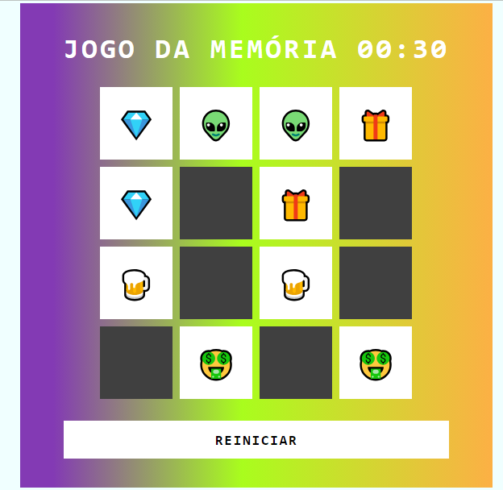

# Jogo da Memória com Emojis

## :rocket: Descrição do projeto

Jogo da memória utilizando emojis como os desenhos das cartas. Projeto faz parte do desafio de código da DIO.

## :books: Modificações

- Alterado o layout(cores) do jogo;

- Implementado reinicio quando o jogador vence o jogo;

- Implementado relógio para contar o tempo;

## :speech_balloon: Conheça mais dos meus projetos

Me adicione no Linkedin :point_right: [Leonardo Abdala](https://www.linkedin.com/in/leonardo-abdala/) e no Github, vamos desenvolver juntos. :facepunch:
